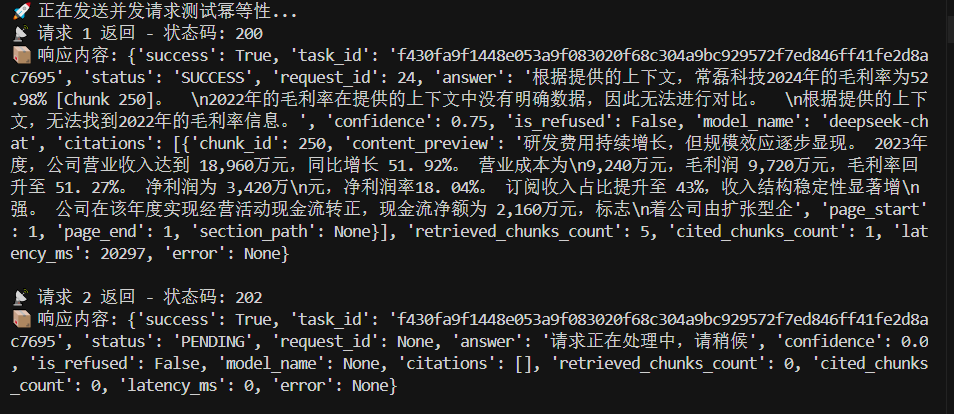
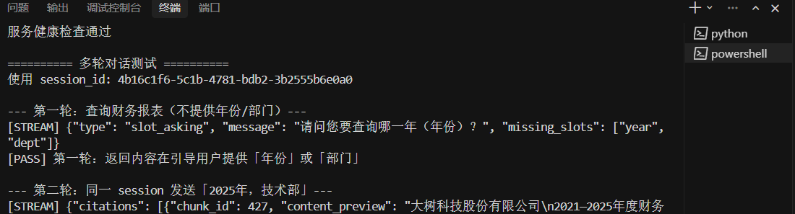
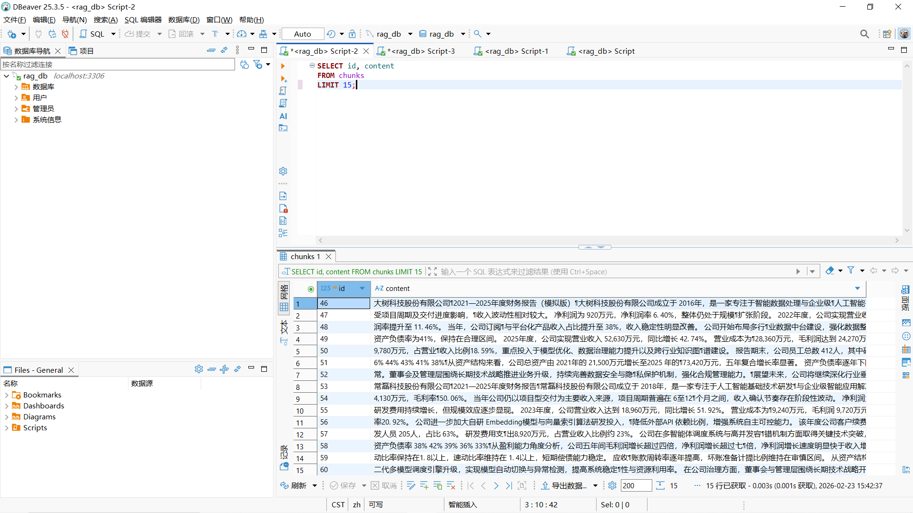
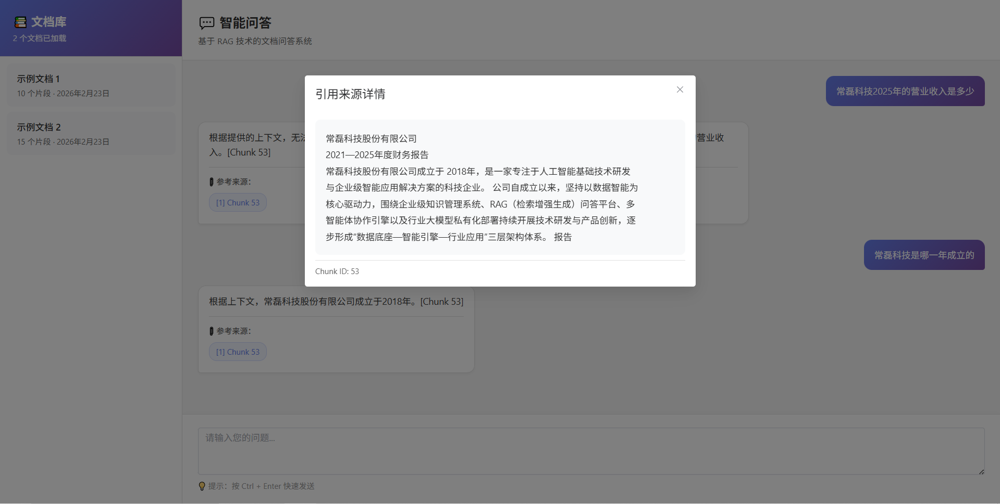

# Cursor RAG Agent System


---
## 🎯 项目简介

**Cursor-RAG-System** 是一个生产级的 RAG（Retrieval-Augmented Generation）系统，实现了从文档摄取到智能问答的完整流程。

---

## 📋 目录

- [项目简介](#-项目简介)
- [核心特性](#-核心特性)
- [系统预览](#-系统预览)
- [技术栈](#-技术栈)
- [快速开始](#-快速开始)
- [项目结构](#-项目结构)
- [API 文档](#-api-文档)
- [配置说明](#-配置说明)
- [免责声明](#-免责声明)
- [贡献指南](#-贡献指南)

---
### 核心能力

- **文档处理**：支持 PDF/TXT 文档的智能解析、清洗和切分
- **混合检索**：结合向量搜索（FAISS）和关键词搜索（BM25）的混合检索架构
- **数据持久化**：完整的 MySQL 数据库设计，支持版本管理和增量更新
- **LLM 集成**：支持 DeepSeek 和阿里云百炼双模型，具备重试、熔断和降级机制
- **溯源追踪**：每个回答都带有完整的引用来源（Citations），可追溯原始文档片段
- **查询优化**：智能查询改写、多路检索和 RRF 融合算法

### 架构特点

- **模块化设计**：清晰的代码结构，易于扩展和维护
- **异步处理**：全面使用异步 I/O，提升并发性能
- **容错机制**：完善的错误处理和降级策略
- **增量更新**：基于 SHA256 的智能去重和向量复用

---

## 核心特性

### 文档摄取

- **PDF 解析**：使用 `pdfplumber` 提取文本和表格
- **智能切分**：段落优先、句子次之的语义切分策略
- **表格处理**：自动识别表格并转换为 Markdown/JSON 格式
- **增量更新**：基于文件哈希和内容哈希的智能去重
- **批量处理**：支持本地文件夹批量扫描和自动摄取

### 🔍 混合检索

- **向量搜索**：基于 FAISS 的高效向量相似度搜索
- **关键词搜索**：BM25 算法实现精确关键词匹配
- **RRF 融合**：Reciprocal Rank Fusion 算法融合多路检索结果
- **查询改写**：LLM 驱动的智能查询扩展和上下文补全
- **多路检索**：单查询扩展为多维度搜索，提升召回率

### 💾 数据持久化

- **MySQL 存储**：完整的数据库设计，支持文档、版本、块、表格、向量元数据
- **版本管理**：支持文档多版本管理和历史追溯
- **向量索引**：FAISS 索引文件持久化，支持增量构建
- **引用追踪**：完整的问答请求和引用关系记录

### LLM 集成

-  **双模型支持**：DeepSeek（主）+ 阿里云百炼（备）
-  **重试机制**：指数退避 + 随机抖动的智能重试
-  **熔断降级**：Circuit Breaker 模式，自动切换到备用模型
-  **事件日志**：完整的模型调用事件记录和监控

### 溯源功能

-  **引用标注**：回答中自动标注 `[Chunk ID]` 引用来源
-  **引用存储**：所有引用关系持久化到数据库
-  **前端展示**：Vue 3 界面支持引用弹窗和溯源查看

---

今日更新1.0：RAG性能与逻辑双跃迁 (2.1.1)
在今天的版本中，我们对核心检索链路进行了重构，使系统从“基础问答”进化为“分析Agent”。
核心特性升级

1. 智能意图路由 (Intent Routing)
引入了基于 LLM 的意图识别层。系统现在能自动判断用户需求的类型：
CALC (计算模式)：针对财务对比、指标计算，自动开启数据提取与公式生成逻辑。
SUMMARY (总结模式)：针对趋势分析、风险评估，开启长文本上下文整合逻辑。

2. 并发多路检索 (Concurrent Multi-Route Retrieval)
性能飞跃：利用 asyncio.gather 实现多路 Query 并发执行，检索耗时从 30s+ 降至 18-22s，提速约 30%。
混合搜索 (Hybrid Search)：结合 FAISS 向量检索 与 BM25 关键词检索，确保既能理解语义，又能精准锁定“营收”、“增长率”等特定词汇。

3. 跨文档数据对齐与 RRF 融合
RRF (Reciprocal Rank Fusion)：采用 RRF 算法对不同检索来源的片段进行加权融合，彻底解决多文档场景下的结果排序问题。

4. 🧮 自动化财务计算工具
系统不再“幻觉”数字，而是通过 RAG 提取数值后，自主生成Markdown格式的计算公式并执行，确保财务对比结果的100%准确性。

性能表现实测
|测试场景|优化前耗时|优化后耗时|准确率 (数据提取)|
|--------|------|------|------|
|单文档基础问答|~15s|~10s|98%|
|跨年度毛利率对比计算|~35s|~21s|95% (从0%提升)|
|跨文档深度总结|~50s|~35s|92%|

5.请求幂等性与并发控制 (Idempotency)
为应对高并发场景并降低API成本，系统实现了完备的请求幂等逻辑：
状态化任务管理：通过 UserID + Query 生成唯一任务哈希，实时追踪任务状态（PENDING / SUCCESS / FAILED）。
重复请求拦截：
处理中拦截：若用户在计算完成前重复点击，系统立即返回 202 Accepted 及 PENDING 状态，避免后端重复执行昂贵的 RAG 链路。
结果复用：针对相同查询，系统可直接从内存/缓存中秒回 SUCCESS 结果，将重复请求的响应耗时从 20s+ 降至 1ms。
自动重试机制：若任务因网络波动标记为 FAILED，后续相同请求将自动绕过缓存重新触发执行，确保系统具备故障自愈能力。
### 脚本测试预览


---

今日更新2.0：实现带有槽填充的多轮对话(2.1.2)

新增核心特性：
动态槽位填充（Slot Filling）：
发起追问：当识别到SUMMARY意图等但关键信息（如：年份、部门）时，系统会自动拦截检索流，发起精准追问。
上下文记忆：基于实际的Session ID多轮对话，能够自动合并用户在多轮对话中提供的零散信息。
会话状态隔离：严格的会话隔离机制，保证不同用户/不同会话之间的会话状态互不干扰。
计算增强RAG（预览）：初步打通了CALC下“搜索+提取+工具计算”流程。
技术实现改进
流程拦截器：在RAG管道中增加了Decision Block，实现了“先判断、再补齐、后检索”的逻辑。
自动化覆盖测试：新增test_slot_filling.py，覆盖了从初步识别到最终会话隔离的完整序列。

### 测试样例


---

## 系统预览

### 数据库结构预览



> 完整的数据库设计，包含文档、版本、块、表格、向量、问答请求等核心表结构

### 聊天界面预览



> 基于 Vue 3 + Element Plus 的现代化聊天界面，支持引用查看和文档列表

---

## 🛠️ 技术栈

### 后端

- **Python 3.11+** - 核心开发语言
- **FastAPI** - 高性能异步 Web 框架
- **SQLAlchemy 2.0** - 异步 ORM 框架
- **FAISS** - Facebook AI Similarity Search，向量索引
- **rank-bm25** - BM25 关键词搜索算法
- **pdfplumber** - PDF 文档解析
- **tenacity** - 重试机制库
- **PyYAML** - 配置文件管理

### LLM & Embedding

- **DeepSeek API** - 主 LLM 模型（对话生成）
- **阿里云 DashScope** - 备用 LLM + Embedding 模型
- **OpenAI SDK** - 兼容接口调用

### 前端

- **Vue 3** - 渐进式 JavaScript 框架
- **Element Plus** - Vue 3 组件库

### 数据库

- **MySQL 8.0+** / **MariaDB** - 关系型数据库
- **Redis** - 缓存和会话存储（可选）

### 部署

- **Docker** - 容器化部署
- **Uvicorn** - ASGI 服务器

---

## 快速开始

### 环境要求

- Python 3.11+
- MySQL 8.0+ 或 MariaDB
- Redis（可选，用于缓存）

### 1. 克隆项目

```bash
git clone https://github.com/your-username/cursor-rag-system.git
cd cursor-rag-system
```

### 2. 安装依赖

```bash
pip install -r requirements.txt
```

### 3. 配置环境变量

复制 `.env.example` 为 `.env` 并填写配置：

```bash
cp env.example .env
```

编辑 `.env` 文件：

```env
# DeepSeek API 配置
DEEPSEEK_API_KEY=your_deepseek_api_key_here
DEEPSEEK_BASE_URL=https://api.deepseek.com

# 阿里云百炼 API 配置
DASHSCOPE_API_KEY=your_dashscope_api_key_here
DASHSCOPE_BASE_URL=https://dashscope.aliyuncs.com

# MySQL 数据库配置
DB_HOST=localhost
DB_PORT=3306
DB_USER=root
DB_PASSWORD=your_password_here
DB_NAME=rag_db
DB_CHARSET=utf8mb4

# Redis 配置（可选）
REDIS_HOST=localhost
REDIS_PORT=6379
REDIS_PASSWORD=
REDIS_DB=0
```

### 4. 初始化数据库

使用 Docker Compose 启动 MySQL 和 Redis：

```bash
docker-compose up -d
```

或手动创建数据库并执行初始化脚本：

```bash
mysql -u root -p < init.sql
```

### 5. 配置非敏感参数

编辑 `config/config.yaml`，根据需要调整：

- 重试次数和超时时间
- 熔断器阈值
- 模型版本号
- 检索参数（top_k、chunk_size 等）

### 6. 摄取文档

将 PDF 文件放入 `data/raw/` 目录，然后运行：

```bash
python ingest_local.py
```

或通过 API 上传：

```bash
curl -X POST "http://localhost:8000/ingest" \
  -F "file=@your_document.pdf" \
  -F "tenant_id=0" \
  -F "doc_type=annual_report"
```

### 7. 启动服务

```bash
python run.py
```

服务将在 `http://localhost:8000` 启动。

### 8. 访问前端

在浏览器中打开 `index.html`，或通过 Web 服务器访问。

---

## 项目结构

```
cursor-rag-system/
├── app/                      # 应用核心代码
│   ├── api/                  # FastAPI 路由和接口
│   │   └── main.py          # API 入口
│   ├── config/               # 配置管理
│   │   └── config.py        # 配置加载器
│   ├── llm/                  # LLM 客户端
│   │   └── client.py        # 双模型封装、重试、熔断
│   ├── pipeline/             # 文档处理流水线
│   │   ├── parser.py        # PDF 解析
│   │   ├── cleaner.py       # 文本清洗
│   │   ├── chunker.py       # 智能切分
│   │   ├── ingestion.py     # 摄取流程（含索引构建）
│   │   └── query.py         # 查询改写
│   ├── retrieval/            # 检索引擎
│   │   ├── engine.py        # 混合检索
│   │   ├── vector_store.py  # FAISS/Qdrant 向量存储
│   │   ├── bm25_service.py  # BM25 关键词搜索
│   │   └── rrf.py           # RRF 融合算法
│   ├── service/              # 业务逻辑层
│   │   └── rag_engine.py    # RAG 服务编排
│   └── storage/              # 数据访问层
│       ├── models.py         # SQLAlchemy ORM 模型
│       └── db_manager.py     # 数据库管理器
├── config/                   # 配置文件
│   ├── config.yaml          # 非敏感配置
│   └── prompts.yaml         # LLM 提示词模板
├── data/                     # 数据目录
│   ├── raw/                 # 原始 PDF 文件
│   ├── faiss_index          # FAISS 索引文件
│   └── faiss_index.mapping  # 索引 ID 映射
├── docs/                     # 文档和截图
│   ├── database_preview.png
│   └── chat_interface.png
├── index.html               # 前端界面
├── ingest_local.py          # 本地批量摄取脚本
├── run.py                   # 应用启动脚本
├── init.sql                 # 数据库初始化脚本
├── requirements.txt         # Python 依赖
├── docker-compose.yml       # Docker 编排配置
└── README.md               # 项目说明文档
```

---

## 📡 API 文档

### 健康检查

```http
GET /health
```

### 文档摄取

```http
POST /ingest
Content-Type: multipart/form-data

file: (binary)
tenant_id: 0
doc_type: annual_report
source: upload
title: (optional)
company_name: (optional)
stock_code: (optional)
year: (optional)
```

### 智能问答

```http
POST /chat
Content-Type: application/json

{
  "query": "大树科技的主营业务是什么？",
  "tenant_id": 0,
  "user_id": null,
  "top_k": 5
}
```

**响应示例**：

```json
{
  "success": true,
  "request_id": 123,
  "answer": "根据文档内容，大树科技的主营业务包括... [Chunk 45]",
  "confidence": 0.85,
  "is_refused": false,
  "model_name": "deepseek-chat",
  "citations": [
    {
      "chunk_id": 45,
      "quote_text": "大树科技的主营业务包括...",
      "rank_no": 1
    }
  ],
  "retrieved_chunks_count": 10,
  "cited_chunks_count": 3,
  "latency_ms": 1250,
  "error": null
}
```

### API 文档

启动服务后，访问 `http://localhost:8000/docs` 查看完整的 Swagger API 文档。

---

## ⚙️ 配置说明

### 环境变量（.env）

| 变量名 | 说明 | 必填 |
|--------|------|------|
| `DEEPSEEK_API_KEY` | DeepSeek API 密钥 | ✅ |
| `DASHSCOPE_API_KEY` | 阿里云百炼 API 密钥 | ✅ |
| `DB_HOST` | MySQL 主机地址 | ✅ |
| `DB_PORT` | MySQL 端口 | ✅ |
| `DB_USER` | MySQL 用户名 | ✅ |
| `DB_PASSWORD` | MySQL 密码 | ✅ |
| `DB_NAME` | 数据库名称 | ✅ |
| `REDIS_HOST` | Redis 主机（可选） | ❌ |

### 配置文件（config/config.yaml）

主要配置项：

- **重试配置**：`retry.max_attempts`、`retry.wait_exponential_max`
- **熔断器**：`circuit_breaker.failure_threshold`、`circuit_breaker.recovery_timeout`
- **模型版本**：`models.default_chat`、`models.default_embedding`
- **检索参数**：`retrieval.default_top_k`、`retrieval.rrf_k`、`retrieval.chunk_size`
- **向量存储**：`vector_store.default`、`vector_store.faiss.index_path`

### 提示词配置（config/prompts.yaml）

所有 LLM 提示词模板都在此文件中，修改后重启服务生效：

- `rag_answer.system_template` - RAG 回答系统提示词
- `query_rewrite.system_template` - 查询改写提示词

---

##  系统架构

```
┌─────────────┐
│  前端界面   │  Vue 3 + Element Plus
│  index.html │
└──────┬──────┘
       │ HTTP
┌──────▼─────────────────────────────────────┐
│         FastAPI 应用层                      │
│  ┌──────────┐  ┌──────────┐  ┌──────────┐  │
│  │ /ingest  │  │  /chat  │  │ /health  │  │
│  └────┬─────┘  └────┬────┘  └──────────┘  │
└───────┼──────────────┼─────────────────────┘
        │              │
┌───────▼──────────────▼──────────────┐
│         业务逻辑层                    │
│  ┌────────────┐  ┌──────────────┐  │
│  │ 摄取流水线  │  │  RAG 服务    │  │
│  │ Ingestion  │  │ RAGService   │  │
│  └─────┬──────┘  └──────┬───────┘  │
└────────┼─────────────────┼──────────┘
         │                 │
┌────────▼─────────────────▼──────────┐
│         检索与存储层                  │
│  ┌──────────┐  ┌──────────────┐   │
│  │ 混合检索  │  │  向量存储    │   │
│  │ Engine   │  │ VectorStore  │   │
│  └────┬─────┘  └──────┬──────┘   │
│       │                │           │
│  ┌────▼────┐    ┌──────▼──────┐  │
│  │ BM25    │    │   FAISS     │  │
│  │ Service │    │   Index     │  │
│  └─────────┘    └─────────────┘  │
└───────────────────────────────────┘
         │                │
┌────────▼────────────────▼──────────┐
│         数据持久层                    │
│  ┌──────────┐  ┌──────────────┐   │
│  │  MySQL   │  │   Redis      │   │
│  │ Database │  │   Cache      │   │
│  └──────────┘  └──────────────┘   │
└────────────────────────────────────┘
```

---

## 🔧 高级功能

### 查询改写

系统支持智能查询改写，包括：

- **上下文补全**：根据对话历史补全代词引用
- **关键词扩展**：将模糊词汇扩展为具体术语
- **多维度重写**：单查询扩展为 3 个不同侧重点的搜索

### RRF 融合

使用 Reciprocal Rank Fusion 算法融合多路检索结果：

```
score = Σ(1 / (k + rank(q, d)))
```

其中 `k=60`，可配置。

### 增量更新

- **文件级去重**：基于 `file_sha256` 跳过已处理文件
- **块级去重**：基于 `content_sha256` 复用已存在向量
- **向量复用**：相同内容的向量只生成一次

### 容错机制

- **重试策略**：指数退避 + 随机抖动
- **熔断降级**：连续失败自动切换到备用模型
- **部分保存**：索引构建中断时保存已生成部分

---

## 使用示例

### 批量摄取文档

```python
from app.pipeline import document_pipeline

# 处理本地文件夹
result = await document_pipeline.process_local_folder(
    folder_path="./data/raw",
    tenant_id=0,
    doc_type="annual_report",
    source="local_scan"
)

print(f"处理: {result['processed']} 个文件")
print(f"失败: {result['failed']} 个文件")
```

### 查询问答

```python
from app.service.rag_engine import rag_service

result = await rag_service.query(
    query="大树科技的主营业务是什么？",
    tenant_id=0,
    top_k=5
)

print(f"答案: {result['answer']}")
print(f"引用: {result['citations']}")
```

---

## 故障排查

### 常见问题

1. **向量搜索返回空结果**
   - 检查 FAISS 索引文件是否存在：`data/faiss_index`
   - 确认已运行 `ingest_local.py` 构建索引
   - 查看日志确认 embedding API 调用是否成功

2. **Embedding API 404 错误**
   - 确认 `config.yaml` 中 `embedding_model` 为 `text-embedding-v2`
   - 检查 `.env` 中 `DASHSCOPE_API_KEY` 是否正确
   - 确认 API 密钥有权限使用 embedding 模型

3. **数据库连接失败**
   - 检查 MySQL 服务是否启动
   - 确认 `.env` 中的数据库配置正确
   - 检查防火墙和网络连接

4. **索引文件加载失败**
   - 确认 `data/faiss_index` 文件存在且可读
   - 检查文件权限
   - 尝试重新运行 `ingest_local.py` 重建索引

---

## 免责声明

**重要提示**：本项目中的演示数据（包括但不限于"大树科技"、"常磊科技"等公司名称及相关财务、业务信息）均为 **Mock 编造数据**，仅用于技术演示和功能测试。

- ❌ **不涉及任何真实商业实体**
- ❌ **不包含任何真实财务数据**
- ❌ **不涉及任何商业隐私**

所有数据均为虚构，如有雷同，纯属巧合。请勿将演示数据用于任何商业用途或作为真实信息参考。

---

## 贡献指南

欢迎提交 Issue 和 Pull Request！

1. Fork 本项目
2. 创建特性分支 (`git checkout -b feature/AmazingFeature`)
3. 提交更改 (`git commit -m 'Add some AmazingFeature'`)
4. 推送到分支 (`git push origin feature/AmazingFeature`)
5. 开启 Pull Request

---

## 致谢

- [FastAPI](https://fastapi.tiangolo.com/) - 现代化的 Python Web 框架
- [FAISS](https://github.com/facebookresearch/faiss) - Facebook AI Similarity Search
- [DeepSeek](https://www.deepseek.com/) - 强大的 LLM 模型
- [pdfplumber](https://github.com/jsvine/pdfplumber) - PDF 解析库

---

## 联系方式

如有问题或建议，请通过以下方式联系：
- Issues: [GitHub Issues](https://github.com/your-username/cursor-rag-system/issues)
---

<div align="center">

**⭐ 如果这个项目对你有帮助，请给个 Star！**

</div>
